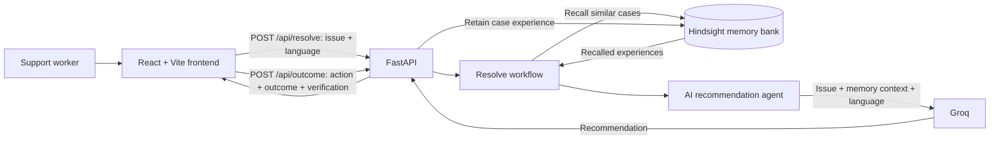

# ResolveIQ

**Support that gets better with every verified outcome.**

ResolveIQ is an AI customer support agent that uses Hindsight by Vectorize to recall relevant support experiences, generate grounded recommendations, and retain outcomes for future cases.

## The Problem

Support teams repeatedly investigate similar issues, while useful resolution details can be scattered across past tickets and conversations. Recommendations without access to verified history risk repeating ineffective actions or claiming success without evidence.

## The Solution

ResolveIQ recalls relevant support memories for each customer issue and provides them to a Groq-powered agent as context. After a support worker records what they did and how the result was verified, the case outcome is retained in Hindsight and can inform future recommendations.

## How The Learning Loop Works

```text
Customer Issue → Hindsight Recall → AI Reasoning → Recommendation → Outcome → Hindsight Retain → Future Learning
```

1. A support worker describes the issue and selects a response language.
2. The backend recalls relevant experiences from the configured Hindsight memory bank.
3. The AI agent uses the issue and recalled context to produce a recommendation in the selected language.
4. The support worker records the action taken, outcome, and verification result.
5. ResolveIQ retains that experience in Hindsight for later recall.

Retaining an outcome does not train or fine-tune the language model. Future learning comes from recalling stored experiences as context.

## Features

- Hindsight-powered recall and outcome retention
- AI recommendations grounded in recalled support experiences
- Outcome-based learning from recorded actions and verification
- Recommendations in English, Telugu, Hindi, Kannada, or Tamil
- Markdown-formatted recommendations, including lists and tables
- Responsive dark interface for desktop and mobile

## Architecture



The Vite development server proxies `/api` and `/health` requests to the local FastAPI server on port `8000`.

## Tech Stack

- **Frontend:** React, Vite, React Markdown, remark-gfm, lucide-react
- **Backend:** Python, FastAPI, Pydantic, Uvicorn
- **Memory:** Hindsight Python client by Vectorize
- **AI:** Groq API; model configured through `GROQ_MODEL`

## Project Structure

```text
resolveiq/
├── backend/
│   ├── .env.example
│   ├── main.py                # FastAPI routes and request/response models
│   ├── resolve_workflow.py    # Recall → recommendation and outcome workflow
│   ├── resolve_agent.py       # Groq recommendation generation
│   ├── hindsight_memory.py   # Hindsight recall and retain operations
│   └── requirements.txt
├── frontend/
│   ├── src/
│   │   ├── App.jsx
│   │   ├── index.css
│   │   └── main.jsx
│   ├── package.json
│   └── vite.config.js
└── README.md
```

## Local Setup

You need Python, Node.js with npm, and API credentials for Hindsight and Groq.

### 1. Configure Backend Environment

From the repository root, create a local environment file from the example:

```powershell
cd backend
Copy-Item .env.example .env
```

Edit `backend/.env` and set your own `HINDSIGHT_API_KEY` and `GROQ_API_KEY`. The example contains placeholders only. Never commit real credentials.

### 2. Install And Run Backend

In the `backend` directory, create a virtual environment and install the dependencies:

```powershell
py -m venv .venv
.\.venv\Scripts\python.exe -m pip install -r requirements.txt
.\.venv\Scripts\python.exe -m uvicorn main:app --reload --port 8000
```

The API health endpoint is `http://localhost:8000/health`; interactive API documentation is available at `http://localhost:8000/docs`.

### 3. Install And Run Frontend

In a second terminal, from the repository root:

```powershell
cd frontend
npm ci
npm run dev
```

Open `http://localhost:5173`. The Vite proxy forwards API requests to the backend at `http://127.0.0.1:8000`.

## Example Use Case

A customer reports a duplicate charge. A support worker enters the issue, reviews any similar Hindsight memories, and receives a recommendation grounded in those recalled cases. After taking action, the worker records whether the issue was resolved and how that result was verified. ResolveIQ retains the outcome so a future duplicate-charge case can recall it.

This illustrates the workflow; the recommendation and resolution depend on the real recalled memories and the support worker's recorded outcome.

## Why Hindsight Is Central

Hindsight gives ResolveIQ a case memory that can be recalled during future support requests. The agent receives retrieved experiences as context rather than relying only on a general-purpose model. The outcome endpoint then retains the action, result, and verification together, connecting recommendations to real support outcomes over time.

## Hackathon Focus: A Verifiable Learning Loop

The project demonstrates a concrete support-learning cycle: retrieve relevant experience, recommend an action, record what actually happened, and retain that verified result for future retrieval. Past cases inform the current recommendation, and the current outcome becomes context for later cases.

## Future Improvements

- Add automated evaluation for recommendation relevance and outcome quality.
- Add operator review tools for correcting or annotating recalled memories.
- Add deployment, monitoring, and rate-limit guidance for production use.
- Improve accessibility and add end-to-end tests for the support workflow.

These are potential next steps and are not part of the current implementation.

## Demo

- **Live demo:** [Add live demo URL](#demo)
- **Demo video:** [Add demo video URL](#demo)
